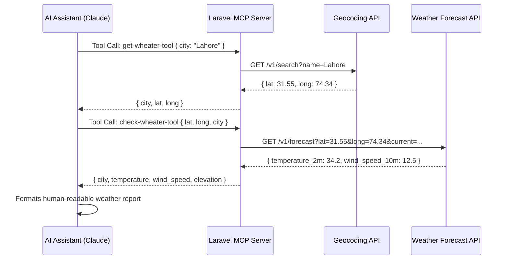

<div align="center">


# 🌤️ Laravel Weather MCP Server

### *A production-ready Model Context Protocol (MCP) server built on Laravel — powering AI assistants with real-time weather intelligence.*

<br/>

[](https://laravel.com)
[](https://php.net)
[](https://modelcontextprotocol.io)
[](https://open-meteo.com)
[](LICENSE)

<br/>

> **"Bridging the gap between AI language models and real-world data — one API call at a time."**

</div>

---

## 📌 Table of Contents

- [What is MCP?](#-what-is-mcp)
- [Project Overview](#-project-overview)
- [Features](#-features)
- [Architecture & Tech Stack](#-architecture--tech-stack)
- [How It Works](#-how-it-works)
- [Project Structure](#-project-structure)
- [Quick Start](#-quick-start)
- [Use in Your IDE (Claude / Cursor / VS Code)](#-use-in-your-ide)
- [Integrate Into Your Own Project](#-integrate-into-your-own-project)
- [API Reference](#-api-reference)
- [External APIs Used](#-external-apis-used)
- [Testing with MCP Inspector](#-testing-with-mcp-inspector)
- [Contributing](#-contributing)

---

## 🤖 What is MCP?

**Model Context Protocol (MCP)** is an open standard introduced by Anthropic that allows AI assistants (like Claude, Cursor AI, GitHub Copilot, etc.) to securely connect to external tools and data sources.

Think of MCP as a **universal plugin system for AI** — instead of hardcoding tool integrations, developers can expose any capability (databases, APIs, file systems) through a standardized protocol that any MCP-compatible AI client can consume.

```
┌──────────────────┐        MCP Protocol        ┌──────────────────────┐
│                  │ ◄─────────────────────────► │                      │
│   AI Assistant   │                             │  Laravel MCP Server  │
│ (Claude/Cursor)  │    JSON-RPC over stdio/HTTP │  (This Project)      │
│                  │ ◄─────────────────────────► │                      │
└──────────────────┘                             └──────────────────────┘
                                                          │
                                              ┌───────────┴───────────┐
                                              │                       │
                                     ┌────────▼──────┐   ┌───────────▼───────┐
                                     │  Geocoding API │   │  Weather Forecast  │
                                     │ (Open Meteo)   │   │  API (Open Meteo)  │
                                     └───────────────┘   └───────────────────┘
```

---

## 🌟 Project Overview

**Laravel Weather MCP Server** is a fully functional MCP server implementation that gives AI assistants the superpower to **fetch real-time weather data** for any city in the world — with zero API keys required.

This project demonstrates how to:
- Build a **production-ready MCP server** using the `laravel/mcp` package
- Implement **multi-step AI tool chaining** (geocoding → weather lookup)
- Design **clean, well-typed PHP 8.2+ tools** using attributes and schema validation
- Expose **zero-cost, free APIs** (Open-Meteo) for weather and geocoding

This serves as an excellent **reference implementation** for anyone looking to build their own MCP server on top of Laravel.

---

## ✨ Features

| Feature | Description |
|---|---|
| 🌍 **City Name Resolution** | Automatically converts any city name to precise GPS coordinates via the Open-Meteo Geocoding API |
| 🌡️ **Real-time Temperature** | Fetches live temperature data (°C) at 2 meters above ground |
| 💨 **Wind Speed Data** | Returns current wind speed at 10m height (km/h) |
| 📍 **Elevation Info** | Includes geographic elevation of the location |
| 🔗 **Tool Chaining** | Two specialized tools work in sequence — geocoding first, then weather lookup |
| 📋 **JSON Schema Validation** | Every tool enforces strict input validation using PHP 8.2 JSON Schema contracts |
| ⚡ **No API Keys Needed** | 100% free Open-Meteo API — no registration or billing required |
| 🏗️ **Clean Architecture** | Follows Laravel's PSR-4 autoloading with a dedicated `App\MCp` namespace |
| 🤝 **MCP Standard Compliant** | Fully compliant with the official MCP specification |
| 🔌 **IDE Ready** | Plug directly into Claude Desktop, Cursor, or VS Code AI extensions |

---

## 🏛️ Architecture & Tech Stack

### Core Technologies

| Technology | Version | Purpose |
|---|---|---|
| **Laravel** | `^12.0` | Application framework & HTTP layer |
| **PHP** | `^8.2` | Language runtime (uses attributes & named args) |
| **laravel/mcp** | `^0.7.0` | MCP server SDK for Laravel |
| **Laravel HTTP Client** | Built-in | HTTP requests to external APIs (powered by Guzzle) |
| **Open-Meteo Geocoding API** | Free | City name → Latitude/Longitude conversion |
| **Open-Meteo Forecast API** | Free | Real-time weather data by coordinates |

### Design Patterns Used

- **Tool Pattern** — Each MCP capability is encapsulated in its own `Tool` class
- **Schema-First Design** — Input validation defined declaratively via `JsonSchema`
- **PHP Attributes** — `#[Description]`, `#[Name]`, `#[Version]` for self-documenting code
- **Server Aggregation** — `WheaterServer` groups related tools under one endpoint
- **Fluent HTTP Client** — Laravel's `Http` facade for clean, readable API calls

---

## ⚙️ How It Works

### Tool 1: `GetWheaterTool` — City → Coordinates

```
AI asks: "What's the weather in Lahore?"
         ↓
GetWheaterTool receives: { "city": "Lahore" }
         ↓
Calls: https://geocoding-api.open-meteo.com/v1/search?name=Lahore&count=1
         ↓
Returns: { "city": "Lahore", "lat": 31.5497, "long": 74.3436 }
```

### Tool 2: `CheckWheaterTool` — Coordinates → Weather

```
AI now calls: CheckWheaterTool with lat/long from previous step
         ↓
Calls: https://api.open-meteo.com/v1/forecast?latitude=31.55&longitude=74.34&current=temperature_2m,wind_speed_10m
         ↓
Returns: { "city": "Lahore", "temperature": 34.2, "wind_speed": 12.5, "elevation": 213.0 }
```

### The Full Flow (End-to-End)



---

## 📂 Project Structure

```
mcp/
├── app/
│   └── MCp/                          # MCP namespace (custom)
│       ├── Servers/
│       │   └── WheaterServer.php     # 🖥️  MCP Server — groups all tools
│       └── Tools/
│           ├── GetWheaterTool.php    # 🔍  Tool 1: City name → Lat/Long
│           └── CheckWheaterTool.php  # 🌤️  Tool 2: Lat/Long → Weather data
├── routes/
│   └── ai.php                        # 🛣️  MCP route registration
├── composer.json                     # 📦  Dependencies (laravel/mcp ^0.7.0)
└── .env.example                      # ⚙️  Environment config template
```

### Key Files Explained

#### `app/MCp/Servers/WheaterServer.php`
The **central registry** for the MCP server. Uses PHP attributes to define server metadata and lists all available tools.

```php
#[Name('Wheater Server')]
#[Version('0.0.1')]
#[Instructions('Instructions describing how to use the server and its features.')]
class WheaterServer extends Server
{
    protected array $tools = [
        GetWheaterTool::class,    // Tool 1: Geocoding
        CheckWheaterTool::class,  // Tool 2: Weather lookup
    ];
}
```

#### `app/MCp/Tools/GetWheaterTool.php`
Accepts a city name and returns its geographic coordinates using Open-Meteo's free Geocoding API.

#### `app/MCp/Tools/CheckWheaterTool.php`
Accepts latitude, longitude (and optional city name) and returns current weather conditions via Open-Meteo's Forecast API.

#### `routes/ai.php`
Registers the MCP server as a local transport endpoint:

```php
Mcp::local('weather', WheaterServer::class);
```

---

## 🚀 Quick Start

### Prerequisites

- PHP `>= 8.2`
- Composer
- Laravel CLI or `php artisan`

### 1. Clone the Repository

```bash
git clone https://github.com/Mrkiyani001/Wheater_Mcp.git
cd Wheater_Mcp
```

### 2. Install Dependencies

```bash
composer install
```

### 3. Environment Setup

```bash
cp .env.example .env
php artisan key:generate
```

### 4. Run Database Migrations

```bash
php artisan migrate
```

### 5. Start the Server

```bash
php artisan serve
```

Your MCP server is now running at `http://localhost:8000` 🎉

---

## 🖥️ Use in Your IDE

### Option A — Claude Desktop

Add this server to your Claude Desktop configuration file.

**Config file location:**
- **Windows:** `%APPDATA%\Claude\claude_desktop_config.json`
- **macOS:** `~/Library/Application Support/Claude/claude_desktop_config.json`
- **Linux:** `~/.config/Claude/claude_desktop_config.json`

```json
{
  "mcpServers": {
    "laravel-weather": {
      "command": "php",
      "args": [
        "C:\\path\\to\\your\\mcp\\artisan",
        "mcp:serve",
        "weather"
      ]
    }
  }
}
```

> ⚠️ Replace `C:\\path\\to\\your\\mcp` with the **absolute path** to this project on your machine.

After saving, **restart Claude Desktop**. You'll see the 🔌 tool icon appear — Claude can now answer weather questions using your server!

---

### Option B — Cursor IDE

Open your Cursor settings and add an MCP server under `Settings > Features > MCP`:

```json
{
  "mcpServers": {
    "laravel-weather": {
      "command": "php",
      "args": ["artisan", "mcp:serve", "weather"],
      "cwd": "C:\\path\\to\\your\\mcp"
    }
  }
}
```

Or via the Cursor MCP config file at `~/.cursor/mcp.json`:

```json
{
  "mcpServers": {
    "laravel-weather": {
      "command": "php",
      "args": ["C:\\path\\to\\your\\mcp\\artisan", "mcp:serve", "weather"]
    }
  }
}
```

---

### Option C — VS Code (GitHub Copilot / Continue.dev)

For **Continue.dev**, add to `~/.continue/config.json`:

```json
{
  "mcpServers": [
    {
      "name": "laravel-weather",
      "command": "php artisan mcp:serve weather",
      "cwd": "C:\\path\\to\\your\\mcp"
    }
  ]
}
```

---

### Option D — Test with MCP Inspector

The **MCP Inspector** is the official browser-based tool for testing MCP servers:

```bash
# Install MCP Inspector globally
npm install -g @modelcontextprotocol/inspector

# Run the inspector against this server
npx @modelcontextprotocol/inspector php artisan mcp:serve weather
```

Open `http://localhost:5173` in your browser to see all available tools and test them interactively.

---

## 🔧 Integrate Into Your Own Project

Want to add weather capabilities to your **existing Laravel application**? Follow these steps:

### Step 1: Install the MCP Package

```bash
composer require laravel/mcp
```

### Step 2: Publish the MCP Config

```bash
php artisan vendor:publish --provider="Laravel\Mcp\McpServiceProvider"
```

### Step 3: Create Your Tool Classes

Copy `GetWheaterTool.php` and `CheckWheaterTool.php` into your own `app/Mcp/Tools/` directory.

### Step 4: Create Your Server

Create `app/Mcp/Servers/WeatherServer.php`:

```php
<?php

namespace App\Mcp\Servers;

use Laravel\Mcp\Server;
use Laravel\Mcp\Server\Attributes\Name;
use Laravel\Mcp\Server\Attributes\Version;
use Laravel\Mcp\Server\Attributes\Instructions;
use App\Mcp\Tools\GetWheaterTool;
use App\Mcp\Tools\CheckWheaterTool;

#[Name('Weather Server')]
#[Version('1.0.0')]
#[Instructions('Provides real-time weather data for any city worldwide.')]
class WeatherServer extends Server
{
    protected array $tools = [
        GetWheaterTool::class,
        CheckWheaterTool::class,
    ];
}
```

### Step 5: Register the Route

Add this to your `routes/ai.php` (create it if it doesn't exist):

```php
<?php

use Laravel\Mcp\Facades\Mcp;
use App\Mcp\Servers\WeatherServer;

Mcp::local('weather', WeatherServer::class);
```

### Step 6: Include the Route File

In `bootstrap/app.php` or `routes/api.php`, load your MCP routes:

```php
// In bootstrap/app.php
->withRouting(
    web: __DIR__.'/../routes/web.php',
    api: __DIR__.'/../routes/api.php',
    commands: __DIR__.'/../routes/console.php',
    then: function () {
        Route::middleware('api')->group(base_path('routes/ai.php'));
    },
)
```

### Step 7: Serve and Connect

```bash
php artisan mcp:serve weather
```

Your application now has weather intelligence powered by MCP! 🌦️

---

## 📡 API Reference

### Tool: `get-wheater-tool`

Resolves a city name to geographic coordinates.

| Parameter | Type | Required | Description |
|---|---|---|---|
| `city` | `string` | ✅ Yes | Name of the city (e.g., `"Lahore"`, `"London"`, `"Tokyo"`) |

**Response:**
```json
{
  "city": "Lahore",
  "lat": 31.5497,
  "long": 74.3436
}
```

---

### Tool: `check-wheater-tool`

Fetches current weather data using geographic coordinates.

| Parameter | Type | Required | Description |
|---|---|---|---|
| `lat` | `string` | ✅ Yes | Latitude of the location |
| `long` | `string` | ✅ Yes | Longitude of the location |
| `city` | `string` | ❌ No | City name (for labeling the response) |

**Response:**
```json
{
  "city": "Lahore",
  "temperature": 34.2,
  "wind_speed": 12.5,
  "elevation": 213.0
}
```

---

## 🌐 External APIs Used

This project is powered entirely by **free, open-access APIs** — no API keys or billing required!

### 1. Open-Meteo Geocoding API
- **URL:** `https://geocoding-api.open-meteo.com/v1/search`
- **Purpose:** Converts city names to latitude/longitude coordinates
- **Docs:** [https://open-meteo.com/en/docs/geocoding-api](https://open-meteo.com/en/docs/geocoding-api)
- **Free Tier:** Unlimited requests, no registration needed

### 2. Open-Meteo Weather Forecast API
- **URL:** `https://api.open-meteo.com/v1/forecast`
- **Purpose:** Returns real-time and forecasted weather data by coordinates
- **Docs:** [https://open-meteo.com/en/docs](https://open-meteo.com/en/docs)
- **Free Tier:** Unlimited requests for non-commercial use

**Variables used:**
| Variable | Meaning |
|---|---|
| `temperature_2m` | Air temperature at 2 meters height (°C) |
| `wind_speed_10m` | Wind speed at 10 meters height (km/h) |
| `elevation` | Geographic elevation of the location (meters) |

---

## 🧪 Testing with MCP Inspector

The **MCP Inspector** provides a visual, interactive UI to test your tools without any AI client:

```bash
# Run directly (no global install needed)
npx @modelcontextprotocol/inspector php artisan mcp:serve weather
```

**Testing `get-wheater-tool`:**
```json
{
  "tool": "get-wheater-tool",
  "input": {
    "city": "Karachi"
  }
}
```

**Testing `check-wheater-tool`:**
```json
{
  "tool": "check-wheater-tool",
  "input": {
    "lat": "24.8607",
    "long": "67.0104",
    "city": "Karachi"
  }
}
```

---

## 🤝 Contributing

Contributions, issues, and feature requests are welcome!

1. Fork the repository
2. Create your feature branch (`git checkout -b feature/add-humidity-data`)
3. Commit your changes (`git commit -m 'feat: add humidity and rainfall support'`)
4. Push to the branch (`git push origin feature/add-humidity-data`)
5. Open a Pull Request

### Ideas for Contribution
- 🌧️ Add humidity, rainfall, UV index data
- 📅 Add 7-day weather forecast tool
- 🗺️ Add support for multiple result locations
- 🌐 Add timezone information to responses
- ✅ Add PHPUnit tests for all tools

---

## 👨‍💻 Author

**Farhan Ul Haq (Mrkiyani001)**

- GitHub: [@Mrkiyani001](https://github.com/Mrkiyani001)
- Built with ❤️ using Laravel + MCP Protocol

---

## 📄 License

This project is open-sourced software licensed under the [MIT license](LICENSE).

---

<div align="center">

**⭐ If you found this project useful, please give it a star! ⭐**

*Built with Laravel 12 · PHP 8.2 · Model Context Protocol · Open-Meteo API*

</div>
